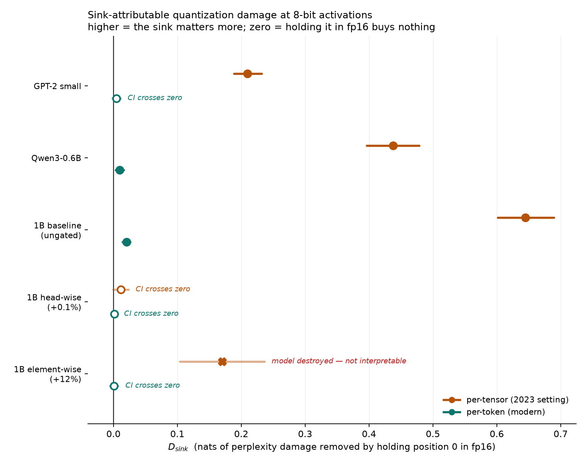
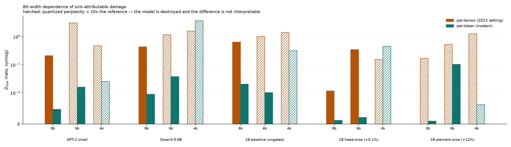
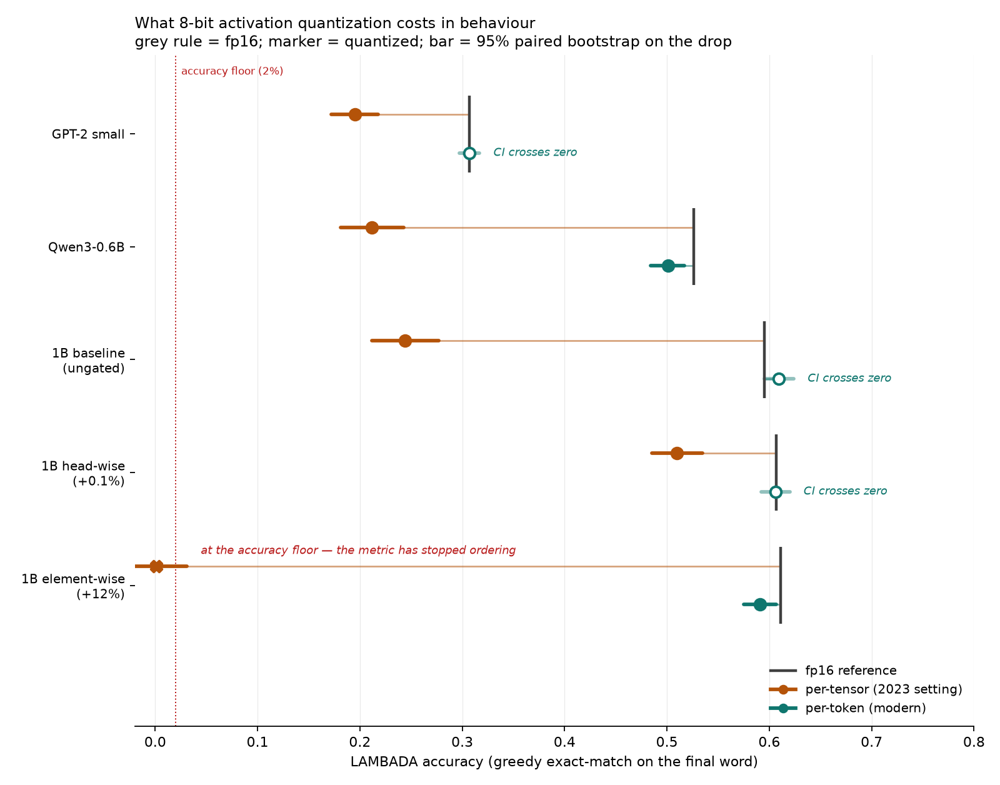

# Attention Sinks and Quantization: An Audit

> **Status: the inference-side audit is complete.** Five checkpoints were
> measured end-to-end across 8, 6 and 4-bit activations: 360 grid cells on 281
> FineWeb-Edu documents, a 60-cell replication at all three widths on a second
> corpus of Python source, and one downstream task (LAMBADA, 1000 examples,
> which is the only metric here that is not perplexity). All four of the
> planned fp16 exception arms have been run; Section 5.9 reports what the two
> beyond `position_0` show.
>
> Every number below is generated by `analysis.report`,
> `analysis.distributions`, `analysis.corpora`, `analysis.lambada` and
> `analysis.figures` reading from `runs/`. None of them are typed by hand. The
> section order puts the finding first and the architecture last.
>
> A pretraining arm (`train/`, for `softmax1`) was specified, partly built and
> **deliberately cut**. Section 6 states what that leaves untested, and
> `train/__init__.py` records which parts of it work and which are contract
> only.

---

## 1. The finding

Architectural sink-mitigation works. It also buys nothing that cannot be
obtained by changing one line in the quantizer, and in the variant the original
paper leads with, it produces a model that breaks badly under the exact
quantization scheme it was designed for.

Three results, all measured on the same controlled set of 1.7B checkpoints that
differ only by a single boolean in `config.json`:

1. **The fix works.** On the matched pair (ungated baseline against the
   head-wise gate, which adds 0.1% parameters), sink-attributable damage under
   per-tensor activation quantization falls from +0.6450 to +0.0117 nats. That
   is a 55x reduction, and the interval on the gated arm crosses zero.
   Per-tensor is the 2023 setting the mitigation literature was built against,
   and the claim holds there.

2. **It is also redundant.** Under per-token activation scaling, which is
   standard practice now, the same damage is already 32-46x smaller on every
   sink-bearing model, including the ungated ones, at a level that is either
   zero or negligible. No architecture change is needed to get it. On a second
   corpus the effect is smaller still: the largest per-token `D_sink` anywhere
   is 0.0117 nats and three of five point estimates are negative (Section 5.7).

3. **Sink mass points at the wrong model.** The element-wise gate is the
   original paper's headline variant and has the lowest sink mass in the set
   (0.019). It is also the only checkpoint here that per-tensor 8-bit
   quantization destroys: Δppl of +3600 against an unquantized perplexity of
   14.5, while the ungated baseline it is meant to improve on takes +18.5 and
   the head-wise arm takes +2.2. Holding the sink in fp16 does not rescue it,
   and the damage is not sink-attributable at all. It comes from one tensor,
   the layer-0 MLP input, of which a shared 8-bit scale rounds 99.3% to zero
   against 9.6% of the same tensor in the ungated baseline. Holding that single
   MLP in fp16 (three modules out of 196) takes the model from 241x its
   reference perplexity back to 1.45x. Section 5.4 has the detail.

Each result on its own would give a misleading impression. The first says the
fix works, the second says it is unnecessary, and the third says the
best-known variant of it is harmful in the setting it was designed for. All
three are true at once.



`D_sink` at 8-bit activations, in nats, with 95% sequence-bootstrap confidence
intervals over the 32 held-out sequences. *ZERO* marks an interval that
contains zero.

| model | ppl_ref | Δppl (per-tensor) | per-tensor (2023) | per-token (modern) | ratio |
|---|---|---|---|---|---|
| GPT-2 small | 29.6 | +11.65 | **+0.2097** [+0.188, +0.232] | +0.0047 [-0.002, +0.011] *ZERO* | 44x |
| Qwen3-0.6B-Base | 17.9 | +14.27 | **+0.4378** [+0.396, +0.479] | +0.0096 [+0.003, +0.016] | 46x |
| `1B_baseline` | 14.7 | +17.94 | **+0.6450** [+0.601, +0.690] | +0.0203 [+0.014, +0.026] | 32x |
| `1B_headwise` (+0.1%) | 14.6 | +2.29 | +0.0117 [-0.0003, +0.024] *ZERO* | +0.0012 [-0.003, +0.005] *ZERO* | — |
| `1B_elementwise` (+12%) | 14.5 | **+3707** (destroyed) | +0.1702 [+0.104, +0.236] (destroyed) | +0.0009 [-0.006, +0.007] *ZERO* | — |

"Destroyed" means the fully-quantized cell has a perplexity above 10x its own
reference. `D_sink` on such a row is a difference between two broken models and
does not rank anything. See Section 5.3.

---

## 2. What this is

This is an audit of a published claim. It is not a new mitigation method and it
is not a discovery of attention sinks. Two things are taken as established and
are not re-tested: that a small number of token positions absorb a
disproportionate share of attention mass, and that those positions carry
extreme residual-stream outliers. The claim under test is the third one:

> that these outliers are what breaks low-bit activation quantization, and that
> mitigating them architecturally buys measurable robustness.

That literature was largely built against per-tensor activation quantization
and pre-QK-Norm architectures. Both have since moved on. The question here is
whether the architectural fix still pays once it is compared against a
properly-configured modern baseline, meaning per-token activation scaling on
models that already use QK-Norm, and reported with confidence intervals, which
almost none of the prior work does.

A negative result, that the architectural fix is largely redundant under modern
quantization practice, was treated as the null hypothesis rather than as a
disappointment. The result came back partly negative, which is the more
interesting outcome.

## 3. What was replicated, and what is new

| | Owner | This repo |
|---|---|---|
| The attention sink | Xiao et al., StreamingLLM | Replicated |
| Massive activations cause the concentration | Sun et al. | Replicated; defines the outlier metric |
| Per-layer sink trajectory, QK-Norm as preventative | The Spike, the Sparse and the Sink | Replicated; their measurement |
| Multi-level sinks in Qwen | CushionCache (Son et al.) | Motivates the detector redesign |
| Keeping position 0 in fp16 | KVQuant | Used as a control, not a contribution |
| Clipped softmax / gated attention | Bondarenko et al. | Extended to modern decoders, with error bars |
| G1 output gating | Qiu et al., NeurIPS 2025 Oral | Used as released; not reimplemented |
| softmax1 | Miller (blog) | Never evaluated with seeds, and still is not here |
| Seed variance and confidence intervals on any of the above | — | **New** |
| Whether sink-mitigation survives per-token activation quant | — | **New** |
| That the best-known gate variant is the most quantization-fragile arm | — | **New** (Sections 5.3, 5.4) |

## 4. Method

Models, metrics and quantization setup are in `configs/`. Metric definitions
were fixed before any data was collected (`sinks/metrics.py`). One definition
was changed afterwards; that change is recorded in Section 6 rather than
applied silently.

**Two kinds of work, which cannot be mixed.** The inference-side work measures
and attributes on pretrained checkpoints. A separate pretraining arm would
train small models from scratch, because `softmax1` cannot be retrofitted onto
pretrained weights. Writing `s = Σexp / (1 + Σexp) < 1`:

```
softmax1(x) = s · softmax(x)
```

The output is not the same attention with less sink. It is the original convex
combination scaled down uniformly. A retrofitted model would therefore degrade
for reasons that say nothing about the mechanism. This identity is checked in
`tests/test_softmax1.py`. The pretraining arm was not carried out; see
Section 6.

**Headline metric.** `D_sink = Δppl(all quantized) - Δppl(sink tokens fp16)`,
computed per model and per activation granularity, decomposed in nats, and
reported with sequence-bootstrap confidence intervals.

**The metric has a validity regime, enforced in code.** `D_sink` is a
difference between two damaged models. Once both are destroyed, that difference
no longer says anything about which one degrades more gracefully. Any cell
whose quantized perplexity exceeds 10x its own reference is flagged as
destroyed by `analysis.figures.is_destroyed`, hatched in Figure 2, and excluded
from ratio columns.

That threshold is a judgement call. The measured ratios fall into clusters with
wide empty gaps between them: 13 cells sit at 1.01-2.22x, two are borderline at
8.7x and 8.9x, and 15 sit at 42.7x and above. A threshold of 10x falls inside
the empty gap, and anything from 10x to 20x behaves identically.
`python -m analysis.report --threshold-sweep` prints the sweep and the sorted
ratios. The finding in Section 5.3 does not change with the threshold; one
sentence in Section 5.5 does, and says so.

## 5. Results

### 5.1 The gated checkpoints are genuinely sink-free

Replicating Qiu et al. on their released checkpoints, and adding the control
that their release makes possible:

| model | mean sink mass | heads > 0.5 | entropy L0 to Ln | residual magnitude | sink-free |
|---|---|---|---|---|---|
| GPT-2 small (no QK-Norm) | 0.383 | 0.396 | 3.04 to 2.94 | 83.7x | no |
| Qwen3-0.6B-Base | 0.523 | 0.565 | 2.09 to 0.79 | 1124x | no |
| `1B_baseline` (control) | 0.439 | 0.464 | 2.58 to 1.32 | 370x | no |
| `1B_headwise` (+0.1% params) | **0.057** | **0.004** | 3.04 to 2.76 | **4.1x** | **yes** |
| `1B_elementwise` (+12% params) | 0.019 | 0.000 | 2.96 to 1.53 | 2.2x | **yes** |

These were measured on the same committed corpus as every damage number below,
which is what makes the comparison between the two metrics in Section 5.3
valid. An earlier version of this table was measured on a streamed sample that
was never recorded, and was replaced.

The head-wise arm is the important one. At 0.1% extra parameters it reduces the
sink by 90x in residual magnitude, so sink elimination is not a capacity
effect. The element-wise arm goes further, but carries 12% extra parameters,
and that increase is confounded with the gate (Section 6).

One detail matters later. Head-wise holds attention entropy nearly flat across
depth (3.04 to 2.76, a fall of 0.28), while element-wise still concentrates
sharply (2.96 to 1.53, a fall of 1.43), which is closer to the ungated
baseline's fall of 1.26 than to its head-wise sibling. So "sink-free" does not
imply "unconcentrated", and the two gates are not doing the same thing.
Sections 5.3 and 5.4 are where that distinction matters.

### 5.2 The audit result

This is the table in Section 1, read column by column.

*The architectural fix works.* On the matched pair, per-tensor `D_sink` falls
from +0.6450 to +0.0117, a factor of 55, with the interval crossing zero. This
is the first check of that claim on a controlled architectural comparison
rather than across models that differ in several ways at once.

*It is also redundant.* Per-token scaling reduces sink-attributable damage by
32-46x on the sink-bearing models, to a level that is zero or negligible,
without touching the architecture. A paper reporting only the first column
would be correct but misleading. One reporting only the second would conclude
that the mitigation does not work.

### 5.3 Sink mass ranks the worst model in the set first

Ordering the five checkpoints by mean sink mass, and then by how much damage
per-tensor 8-bit activation quantization actually does (Δppl, mean over five
calibration draws):

| by sink mass (least first) | | by per-tensor 8-bit damage (least first) | |
|---|---|---|---|
| `1B_elementwise` | 0.019 | `1B_headwise` | +2.2 |
| `1B_headwise` | 0.057 | GPT-2 small | +8.1 |
| GPT-2 small | 0.383 | Qwen3-0.6B | +14.3 |
| `1B_baseline` | 0.439 | `1B_baseline` | +18.5 |
| Qwen3-0.6B | 0.523 | `1B_elementwise` | **+3600** |

The metric gets four of five roughly right and puts the worst model in the set
first. Element-wise carries the least sink mass and takes 195x more damage than
the ungated baseline it is supposed to improve on, and 1600x more than its own
head-wise sibling, which differs from it by one boolean and 12% of parameters.

Entropy explains the direction. Head-wise keeps attention diffuse across depth,
while element-wise still concentrates, close to the baseline. Element-wise
strips attention mass off position 0 while keeping the concentration structure
that per-tensor quantization has trouble with.

So sink mass is not a sufficient predictor of quantization sensitivity.
Selecting or evaluating an architecture on sink mass alone, as much of this
literature does, uses a proxy that can rank two real models the wrong way
round. It does so here on the pair a practitioner would most likely be choosing
between.

*What is claimed and what is not.* This is an existence proof that the standard
metric inverts on real checkpoints. The stronger claim, that sink mass is the
wrong metric in general, is not supported by two arms of one lab's training run
and is not made here.

*A correction to an earlier version of this README.* This section previously
made the same argument from `D_sink` (+0.1702 for element-wise against +0.0117
for head-wise). That comparison was invalid: at Δppl +3600 the element-wise
per-tensor cell is a destroyed model, so its `D_sink` is a difference between
two broken models, which is the same failure this repo flags at 4 bits
(Section 6) and had missed at 8. The claim survives the correction in a
stronger form, based on total damage rather than on a difference of
differences, and the flagging is now enforced in code rather than left to the
reader.

### 5.4 Where the damage actually is

`quant/diagnose.py` splits a grid cell into the parts the grid cannot see. The
numbers below are 8-bit, calibration draw 0, Δppl against each model's own
unquantized reference:

| model | weights only | acts per-tensor, static | acts per-tensor, dynamic | acts per-token |
|---|---|---|---|---|
| GPT-2 small | +0.16 | +11.82 | +6.35 | +0.27 |
| Qwen3-0.6B-Base | +0.23 | +14.13 | +9.67 | +0.57 |
| `1B_baseline` | +0.04 | +17.88 | +13.47 | +0.68 |
| `1B_headwise` | +0.008 | **+2.29** | +1.30 | +0.40 |
| `1B_elementwise` | +0.01 | **+3388** | **+3482** | +0.68 |

The decomposition is not an independent estimate added on afterwards. Its
`full_static` arm reproduces each grid cell's Δppl to four decimals
(element-wise gives +3707.3783 here against +3707.38 in the grid), which checks
that the two code paths agree on the same held-out slice.

Three things follow:

- **Weight quantization is free at 8 bits per-channel on every model.** The
  hard gate's asymmetric signature holds, and all the damage under audit is on
  the activation side.
- **Per-token scaling is nearly free on every model, element-wise included**
  (+0.69, the same as the ungated baseline). Whatever breaks element-wise is a
  property of sharing one scale across the tensor, not a property of the model.
- **It is not a calibration artifact.** Static per-tensor clips anything the
  calibration pass did not see, which would be the obvious explanation for a
  catastrophe. That is ruled out here: the dynamic arm, which sees the exact
  tensor and cannot clip, is worse (+3505 against +3416). Range coverage on
  element-wise is also unremarkable, with a median held-out to calibrated ratio
  of 1.056 and a maximum of 2.42, against maxima of 1.65-1.68 elsewhere.

For the four ordinary models, static costs 1.3-1.5x dynamic, which is the
expected clipping penalty. Element-wise is the only arm where that ordering
reverses, and the only one where per-tensor is not survivable.

**The obvious mechanism was tested and does not hold.** The natural suspect is
the gate itself. It is fused into `q_proj` as extra output width, so the
element-wise arm carries 2048 sigmoid multipliers per token per layer against
the head-wise arm's 16, and a multiplicative gate near zero amplifies the
relative error of whatever feeds it. Leaving `q_proj` entirely in fp16, gate
included, so that 168 layers are quantized instead of 196, tests this directly:

| element-wise, 8-bit per-tensor | static | dynamic |
|---|---|---|
| all layers quantized | +3388 | +3482 |
| `q_proj` (carries the gate) in fp16 | **+3468** | +3261 |
| `o_proj` (consumes the gated output) in fp16 | +3052 | +2611 |
| *head-wise control,* `q_proj` *in fp16* | +2.24 (against +2.29) | +1.32 (against +1.30) |

Exempting the gate projection changes nothing. The model is destroyed either
way, and the static arm is marginally worse for it. Exempting `o_proj` recovers
about 10%, which on a model at 235x its reference perplexity is not a rescue.
So the damage is not in the gate path, and the amplification explanation above
is wrong as stated.

That much was in the previous version of this section, which then inferred that
the damage must be distributed across the network. That inference does not
follow and is false; it is retracted. The damage is localised. It simply was
not in either of the two projections that had been tested.

#### Resolved: one tensor, at layer 0

Per-tensor and per-token scaling differ in exactly one respect, which is
whether the scale is shared across token rows. Same rounding, same clamp, same
bit width. So the entire gap between the two arms must be expressible as a
property of how magnitude is distributed across rows.
`quant/distributions.py` measures that directly on every layer's input, while
quantizing nothing:

- **row dispersion** is `amax(tensor) / median row amax`. This is the factor by
  which one shared scale is too coarse for a typical token, which is exactly
  the quantity per-token scaling divides out. It is 1.0 when per-token buys
  nothing.
- **underflow** is the fraction of entries that round to zero, computed under
  each granularity's own scale.

A layer is called annihilated when a shared scale rounds more than 90% of its
input to zero. Ranked by the damage the statistic has to explain:

| model | Δppl per-tensor | Δppl per-token | median underflow, per-tensor | per-token | annihilated layers | blocks | first block |
|---|---|---|---|---|---|---|---|
| `1B_headwise` | +1.30 | +0.39 | 0.187 | 0.085 | 1/196 | 1/28 | 27 |
| GPT-2 small | +6.35 | +0.27 | 0.110 | 0.050 | 1/48 | 1/12 | 2 |
| Qwen3-0.6B-Base | +9.67 | +0.57 | 0.169 | 0.109 | 3/196 | 3/28 | 2 |
| `1B_baseline` | +13.47 | +0.68 | 0.193 | 0.104 | 10/196 | 6/28 | 2 |
| `1B_elementwise` | **+3481.54** | +0.68 | 0.366 | 0.139 | 15/196 | 9/28 | **0** |

The control column is the important one. Counted under per-token scales, the
same models give 1, 0, 0, 0, 0 annihilated layers. That is flat, and flat is
what it has to be, because per-token damage is nearly free across the whole
set. A statistic that tracked the per-tensor spread and also the per-token
non-spread would be measuring the checkpoint rather than the granularity, and
would explain nothing. This one is specific to granularity by construction and
in the data.

But the count only ranks; it does not scale. Element-wise has 1.5x the
baseline's annihilated layers and takes 258x the damage, and its worst layer is
much milder than the baseline's (dispersion 43 against 1538). What separates
them is depth. Element-wise is the only model in the set whose annihilated
blocks start at layer 0 and run unbroken to layer 7. At the head of that run is
the tensor feeding `gate_proj` and `up_proj`, the two branches of the layer-0
SwiGLU, which share one input:

| model | row dispersion | col dispersion | underflow per-tensor | per-token | per-feature |
|---|---|---|---|---|---|
| Qwen3-0.6B | 1.4x | 10.6x | 0.1181 | 0.0851 | 0.0107 |
| 1B baseline (ungated) | 1.6x | 8.5x | 0.0957 | 0.0681 | 0.0109 |
| 1B head-wise (+0.1%) | 1.6x | 5.9x | 0.0705 | 0.0343 | 0.0113 |
| **1B element-wise (+12%)** | **28.4x** | **304.0x** | **0.9926** | 0.4620 | 0.0107 |

One boolean in `config.json` separates the last row from the two above it.
Under a shared 8-bit scale that tensor loses 99.26% of its entries to rounding,
against 9.6% for the ungated baseline. Under per-row scales the same tensor
loses 46%, which is elevated but survivable, and is the reason per-token stays
at +0.68 on the same checkpoint.

**Which axis this is, and which it is not.** An earlier version of this section
reported only the row column and described the failure as row dispersion, on
the reasoning that row dispersion is precisely what per-token scaling divides
out. The reasoning is valid, but the description was never checked against the
transposed statistic, and when it was, it did not hold. The gate raises both
axes far above both siblings, and raises the feature axis more (36-52x against
18x). The feature axis also does not separate the set: it is the more dispersed
axis at every model's worst layer, including head-wise, the least damaged model
here, at 248.9x, and per-feature underflow sits at 0.01-0.06 everywhere
regardless of damage.

So the discriminating statistic is the per-tensor column and only that, which
is what the rest of this section rests on. What is retracted is the tidier
mechanism around it. Per-token scaling is sufficient, which the grid shows
directly, but not because it addresses the dominant axis. It takes this tensor
from 99.3% underflow to 46%, and 46% at one layer is survivable where 99.3% is
not. That is a weaker statement than the one it replaces.
`python -m analysis.distributions --axis` prints the full set.

**The causal test.** `--skip-modules` holds named projections in fp16, so the
claim can be run rather than argued. Every row uses `a_only_dynamic`, the arm
that cannot clip:

| model | left in fp16 | modules | Δppl | ppl / ppl_ref |
|---|---|---|---|---|
| `1B_elementwise` | nothing *(control)* | 0/196 | +3481.54 | 241x |
| `1B_elementwise` | blocks **8-15** MLP | 24/196 | +3342.39 | 232x |
| `1B_elementwise` | block **0** MLP | **3/196** | **+6.57** | **1.45x** |
| `1B_elementwise` | blocks 0-3 MLP | 12/196 | +6.39 | 1.44x |
| `1B_elementwise` | blocks 0-7 MLP | 24/196 | +1.45 | 1.10x |
| `1B_baseline` | block 0 MLP | 3/196 | +12.96 | 1.88x *(control: +13.47)* |
| `1B_headwise` | block 0 MLP | 3/196 | +1.36 | 1.09x *(control: +1.30)* |

Three modules, 1.5% of the quantized layers, take the element-wise arm from
241x its reference perplexity to 1.45x, a 530x reduction in damage. The
specificity is what makes this a result rather than a coincidence. Exempting
eight other blocks' MLPs, which is twenty-four modules instead of three,
changes almost nothing (+3342). The same three-module exemption on the two
sibling checkpoints does nothing at all: the baseline moves 3.8% and head-wise
does not move. The intervention only works on the model the distributional
measurement flagged, at the layer it flagged.

**What is now established.** The element-wise arm's per-tensor catastrophe is
not distributed, not in the gate path, and not a calibration artifact. It is
one tensor: the layer-0 MLP input, which a shared 8-bit scale annihilates
(99.3% of its entries rounded to zero, against 9.6% on the ungated baseline)
and which per-row scales leave at a survivable 46%. Because it sits at block 0,
all 28 blocks then process the damaged output, which is how a single tensor
produces +3482 rather than a few points. What this does not explain is which
axis the dispersion sits on, or why per-token scaling suffices; see the
correction above.

#### Across bit widths: the mechanism outlives the remedy

Everything above is 8-bit. Row dispersion turns out never to have been a
bit-width-dependent number. It is `amax / median row amax`, a property of the
tensor, and it is identical at 8, 6 and 4 bits across 1664 layer-observations
on both corpora. Underflow does depend on the grid, and that is where the whole
bit-width story is.

| | 8-bit | 6-bit | 4-bit |
|---|---|---|---|
| layer-0 underflow, element-wise | 0.9926 | 0.9991 | 0.9998 |
| layer-0 underflow, `1B_baseline` | 0.0957 | 0.3591 | 0.9134 |
| **contrast** | **10.4x** | **2.8x** | **1.09x** |
| exempting block 0 buys | **530x** | **39x** | 3.82x |
| the same for 8 *other* blocks | 1.04x | 0.90x (worse) | **1.92x** |
| the same exemption on head-wise | 0.96x (worse) | 1.10x | **2.81x** |

Reading down the columns: at 8 and 6 bits the intervention is specific. The
layer-0 MLP buys two orders of magnitude, unrelated blocks buy nothing, and the
undamaged siblings do not move. At 4 bits it is not specific. Eight unrelated
blocks buy 1.92x and the same exemption on a healthy sibling buys 2.81x, both
the same order as the treatment itself. When every layer is failing, exempting
anything helps a little, and the experiment stops being an experiment.

The remedy also fails one width before the mechanism does. At 8 bits,
exempting the layer-0 MLP produces a working model at 1.45x its reference. At 6
bits the same exemption is still 39x better than its control and still
specific, but leaves the model at 91.7x. The damage is still concentrated in
that tensor; fixing it alone has stopped being enough.

This also explains Section 5.5. Per-token underflow on that one tensor runs
0.462, then 0.612, then 0.954 at 8, 6 and 4 bits. Section 5.5 reports that
per-token scaling's absorption of sink damage weakens as the bit width falls
but could not say why. This is why, at the tensor level: per-row scales take it
from 99% underflow to 46% at 8 bits, 61% at 6, and 95% at 4, at which point
per-row scaling stops rescuing it too. Both corpora agree to within 6%
throughout.

The whole of this replicates on the second corpus. The causal test was run
again at 6 and 4 bits on Python source, and every cell agrees:

| bits | block 0 buys | | 8 *other* blocks | | head-wise sibling | |
|---|---|---|---|---|---|---|
| | web | code | web | code | web | code |
| 8 | 530x | 3265x | 1.04x | 1.01x | 0.96x | 1.07x |
| 6 | 39x | 151x | 0.90x | 1.01x | 1.10x | 1.07x |
| 4 | 3.82x | 5.11x | **1.92x** | **2.64x** | **2.81x** | **1.62x** |

The controls are tight at 8 and 6 bits on both corpora, and both controls fail
at 4 bits on both. This is the first bit-width result in the audit that needs
no caveat about which corpus produced it. Section 5.5's thresholds did not
travel across corpora, and Section 5.4's cross-model ranking did not either.
The intervention does, at every width.

The intervention looks stronger on code only because its control is worse.
Element-wise sits at 1297x its reference there before any exemption, against
241x on web, so there is more damage available to remove.

**What is still unexplained.** Why training with an element-wise gate reshapes
that particular tensor is not accounted for here. This work locates the failure
without explaining its origin.

**What has since been retracted.** An earlier version of this section also
claimed that the annihilated-layer count ranks the set by per-tensor damage. It
does on FineWeb-Edu, at thresholds of 90%, 95% and 99%. It does not on the code
corpus, at any threshold (Section 5.7). That claim always rested on five models
with one 258x outlier carrying most of the apparent correlation, and it took
the second corpus to see through it. The localisation above is unaffected: it
is an intervention with controls on one model, and it reproduces on both
corpora, more strongly on the second.

### 5.5 Bit width: where the redundancy starts to give

The 8-bit grid could not answer whether per-token scaling's absorption of sink
damage is universal or only holds where quantization is gentle. 4-bit could not
settle it either, because every cell there is destroyed under both
granularities, so the apparent per-token `D_sink` at 4 bits ranks nothing.
6-bit was run to put an interpretable width in between.

`D_sink` under per-token scaling, which is the arm the research question is
about. "(destroyed)" marks a width where that model is destroyed under
per-token as well, so the cell ranks nothing; those cells are shown rather than
omitted, to make the 4-bit column's uselessness visible:

| model | 8-bit | 6-bit | 4-bit |
|---|---|---|---|
| GPT-2 small | +0.0047 [-0.002, +0.011] *ZERO* | **+0.0160** [+0.001, +0.030] | +0.0253 [-0.018, +0.070] *ZERO* (destroyed) |
| Qwen3-0.6B-Base | +0.0096 [+0.003, +0.016] | **+0.0379** [+0.015, +0.061] | +3.7120 [+3.289, +4.112] (destroyed) |
| `1B_baseline` | +0.0203 [+0.014, +0.026] | +0.0102 [-0.007, +0.027] *ZERO* | +0.3155 [+0.173, +0.477] (destroyed) |
| `1B_headwise` | +0.0012 [-0.003, +0.005] *ZERO* | +0.0021 [-0.018, +0.022] *ZERO* | +0.4581 [+0.386, +0.531] (destroyed) |
| `1B_elementwise` | +0.0009 [-0.006, +0.007] *ZERO* | **+0.1036** [+0.046, +0.168] | +0.0062 [-0.061, +0.074] *ZERO* (destroyed) |



The redundancy weakens, and it weakens unevenly. Going from 8 to 6 bits,
sink-attributable damage under per-token scaling grows 3.4x on GPT-2 and 4.0x
on Qwen3, crossing from indistinguishable-from-zero to distinguishable on
GPT-2, and 111x on the element-wise arm, which is the same arm that fails
everywhere else in this audit. It does not grow on the controlled pair:
`1B_baseline` falls back across zero, with its interval widening rather than
moving, and `1B_headwise` stays at zero. Three of five checkpoints exclude zero
at 6 bits, against two of five at 8 bits.

So the answer is qualified rather than clean. Per-token scaling's absorption of
sink damage is not bit-width invariant. But the arms that carry the controlled
architectural comparison are precisely the ones that do not show the effect, so
this does not rescue the mitigation claim. It says that the redundancy result
is an 8-bit result, and that the margin is thinner at 6.

**Per-tensor quantization does not survive to 6 bits at all.** Four of five
models are destroyed, with Δppl from +1200 to +128000. On FineWeb-Edu the
single exception is `1B_headwise` at +112, degraded by 8.7x and the only
checkpoint still usable. On the code corpus that cell crosses the line too and
nothing survives, as described below. The corpus qualifier is doing real work
here and was not in the original version of this sentence. What holds on both
corpora is the rest: the architectural fix buys something real and large in the
low-bit per-tensor regime, it buys it in a setting nobody deploys, and the
+0.1% variant is the one that buys it while the +12% variant is three orders of
magnitude worse.

#### On a second corpus, only half of this survives

Everything above is FineWeb-Edu. Section 5.7 establishes that this project's
interventional claims travel across corpora and its ordering claims may not,
and this section is entirely the second kind: numbers read off a grid with no
intervention behind them. The code corpus was run at 6 and 4 bits for exactly
that reason. `python -m analysis.corpora --bitwidth` generates all of the
following.

| claim from this section | FineWeb-Edu | code | |
|---|---|---|---|
| 8 to 6 per-token growth, GPT-2 | 3.4x | 3.8x | **holds** |
| 8 to 6 per-token growth, Qwen3 | 4.0x | 17.1x | **no** |
| 8 to 6 per-token growth, element-wise | 111x | 13.0x | **no** |
| "does not grow on the controlled pair" | baseline 0.5x, head-wise flat | baseline **1.6x**, head-wise flat | **half** |
| per-token intervals excluding zero, 8 to 6 | 2/5 to 3/5 | 3/5 to **3/5** | **no** |
| per-tensor survivors at 6 bits | head-wise, alone | **none** | **no** |
| per-tensor survivors at 4 bits | none | none | **holds** |
| least-damaged under per-tensor, 8 and 6 bits | head-wise, 5x and 11x clear | head-wise, 5x and 5x clear | **holds** |

The direction travels; the thresholds and the growth rates do not. Head-wise is
the least-damaged model under per-tensor at both 8 and 6 bits on both corpora,
by a clear margin every time. That is this section's substantive claim and it
is intact. What does not survive is the sentence above about the single
exception: on code, head-wise's 6-bit per-tensor cell sits at 12.4x its
reference against 8.7x on web, so it crosses the destroyed line and no model
survives per-tensor at 6 bits. That is the only change in destroyed-status
anywhere between the two corpora, at any width.

This was predicted. That cell was already on record as the one borderline
result in the repo, with the note that a stricter threshold would turn "the
single exception being head-wise" into "no model survives" while leaving the
direction untouched. A corpus change did what a threshold change would have
done, which is useful to know about that threshold, and is the reason the
paragraph above now names the corpus it is true of. A smaller error was caught
by the same check: the element-wise growth figure was 111x, not the 115x
previously reported, because it had been computed by dividing two values that
were already rounded to four decimals.

The threshold's own sensitivity is unchanged and still worth reading.
`python -m analysis.report --threshold-sweep` prints it, and the reasoning
behind the 10x figure is in Section 4.

### 5.6 Negative and null results

- Under per-token activation quantization at 8 bits, `D_sink` is statistically
  indistinguishable from zero on 3 of 5 models, including one sink-bearing one.
- `D_sink` is undefined for the gated arms in the `detected_sinks` exception
  arm, because with no sink positions there is nothing to hold in fp16. That is
  not missing data; it is what sink-free means (Section 6).
- The pre-registered variance source, disjoint calibration draws, turned out
  not to apply to the per-token arm at all. Five draws give byte-identical
  results, with a standard deviation of exactly 0.000000, which can be verified
  with `python -m analysis.report`. Confidence intervals bootstrap over
  held-out sequences instead. A project auditing single-run numbers found its
  own variance plan half-void, and that is recorded rather than quietly
  patched.
- The 4-bit grid is uninterpretable in both granularities and is reported as
  such rather than dropped.
- The feature-axis exception arm (`outlier_channels`) is undefined for both
  gated checkpoints, for the same reason as above: the gate left no outlier
  channel to exempt. It buys nothing on two of the three models where it can be
  run (Section 5.9).
- `detected_sinks` is undefined for the same two checkpoints, and on the other
  three it selects exactly position 0, so its cells are bit-identical to the
  `position_0` arm. The grid therefore has three real exception arms, not four
  (Section 5.9).

### 5.7 Corpus sensitivity: what survives a change of domain

Every number above rests on one corpus, and the project's largest known
sensitivity has always been that fact (Section 6). The first swap performed,
replacing the repo's own markdown with FineWeb-Edu, moved the headline
matched-pair reduction by about 5x and flipped two intervals across zero. Two
corpora show that the sensitivity exists. They cannot bound it, because nothing
separates "a different sample of similar text" from "a different domain".

`data/code_python.txt` is the third corpus and is deliberately the most distant
one available: 1.2M characters of Python source from
`codeparrot/codeparrot-clean-valid`, a validation split, so not a training
target for any checkpoint here, set against educational web prose, with every
fetch parameter held identical. Generated by `python -m analysis.corpora`.

The reference models behave very differently on it. Code is far more
predictable, with `ppl_ref` falling from 14.5-29.6 to 5.3-11.2, and it
quantizes better, with per-tensor damage down 2.7-4.6x on every model. Except
one.

| model | ppl_ref web | ppl_ref code | Δppl per-tensor web | Δppl per-tensor code |
|---|---|---|---|---|
| GPT-2 small | 29.6 | 11.2 | +11.65 | +4.25 |
| Qwen3-0.6B-Base | 17.9 | 6.3 | +14.27 | +3.12 |
| `1B_baseline` | 14.7 | 5.4 | +17.94 | +5.20 |
| `1B_headwise` | 14.6 | 5.3 | +2.29 | +0.66 |
| `1B_elementwise` | 14.5 | 5.3 | **+3707.38** (destroyed) | **+5357.24** (destroyed) |

#### What survived

**The fix works.** Per-tensor `D_sink` on the matched pair falls from +0.6450
to +0.0117 on web (55x) and from +0.5196 to +0.0113 on code (46x), with the
head-wise interval crossing zero both times. Same conclusion, same order of
magnitude.

**It is redundant, more so on code.** Per-token `D_sink`, both corpora:

| model | per-tensor, web | per-tensor, code | per-token, web | per-token, code |
|---|---|---|---|---|
| GPT-2 small | +0.2097 | +0.1496 | +0.0047 *ZERO* | -0.0098 |
| Qwen3-0.6B-Base | +0.4378 | +0.2821 | +0.0096 | -0.0016 *ZERO* |
| `1B_baseline` | +0.6450 | +0.5196 | +0.0203 | +0.0117 |
| `1B_headwise` | +0.0117 *ZERO* | +0.0113 *ZERO* | +0.0012 *ZERO* | -0.0039 |
| `1B_elementwise` | +0.1702 (destroyed) | +0.1543 (destroyed) | +0.0009 *ZERO* | +0.0025 *ZERO* |

On code the largest per-token `D_sink` anywhere is 0.0117 nats, and three of
five point estimates are negative, meaning that holding position 0 in fp16 made
the model very slightly worse. A negative sink-attributable damage is not a
physical quantity; it is the metric reporting noise. So the honest statement is
stronger than "the redundancy holds": under per-token scaling on code, `D_sink`
has no measurable sign, let alone a magnitude. The ratio column is mostly blank
there for that reason, because the generating code suppresses a ratio when the
denominator is not real damage.

**The element-wise failure, and it is worse.** The element-wise arm is
destroyed on both corpora, harder on code: 1003x its reference perplexity
against 257x on web. No cell on either corpus changes destroyed-status.

**The layer-0 localisation, and it is stronger.** The layer-0 MLP input:

| model | dispersion web | dispersion code | underflow/tensor web | underflow/tensor code |
|---|---|---|---|---|
| Qwen3-0.6B | 1.4x | 1.6x | 0.1181 | 0.1010 |
| `1B_baseline` | 1.6x | 1.5x | 0.0957 | 0.1012 |
| `1B_headwise` | 1.6x | 2.2x | 0.0705 | 0.0851 |
| `1B_elementwise` | **28.4x** | **25.9x** | **0.9926** | **0.9916** |

And the causal test, with its controls:

| left in fp16 | Δppl web | vs control | Δppl code | vs control |
|---|---|---|---|---|
| nothing *(control)* | +3481.54 | — | +6929.49 | — |
| block 0 MLP (3/196 modules) | **+6.57** | **530x better** | **+2.12** | **3265x better** |
| blocks 8-15 MLP (24/196) | +3342.39 | — | +6868.91 | — |

Every model's single worst layer is the same layer on both corpora:
`L6.mlp.down_proj` on the baseline, `L2.mlp.down_proj` on Qwen3,
`L5.mlp.gate_proj` and `up_proj` on element-wise, and `h.2.mlp.c_proj` on
GPT-2. The sibling controls hold too: exempting block 0 moves the baseline 0.5%
and head-wise 6.7% on code.

#### What did not

**The cross-model ranking is retracted.** Section 5.4 previously reported that
the annihilated-layer count orders the set by per-tensor damage. Counts are
listed below in increasing order of damage, so a row that is not non-decreasing
is a threshold at which the statistic does not rank:

| corpus | >50% | >70% | >90% | >95% | >99% | orders damage at |
|---|---|---|---|---|---|---|
| FineWeb-Edu | 27,1,19,27,47 | 8,1,11,22,29 | 1,1,3,10,15 | 1,1,2,5,11 | 0,0,1,4,6 | 90%, 95%, 99% |
| code | 26,19,2,29,49 | 14,11,1,23,29 | 3,3,1,11,15 | 1,3,1,5,11 | 0,1,0,4,6 | **no threshold** |

It did not survive contact with a second domain. Head-wise picks up annihilated
layers on code, from 1 to 3, while remaining the least damaged model by a
factor of five, and GPT-2 and Qwen3 swap places. The claim rested on five
models with one 258x outlier supplying most of the apparent correlation, which
had been flagged as a risk at the time. This is that risk arriving.

**The distinction is worth keeping.** What survived is an intervention with
controls, on one model, run on two corpora. What died is a rank correlation
over five points. Those are not the same kind of evidence, and the corpus swap
separated them, which is what a second corpus is for.

### 5.8 The one downstream task: does any of this reach behaviour?

Every result above is an ordering of perplexity damage, and this project's
corrections are mostly about perplexity orderings that did not survive a second
corpus or a second threshold. LAMBADA is the independent check planned from the
start: last-word prediction, scored as greedy exact-match, which is
`lm-eval-harness`'s `lambada_openai` `acc`. 1000 examples, 8-bit activations,
generated by `python -m analysis.lambada`.

The protocol reproduces a published number. GPT-2 small scores 0.3070 here
against roughly 0.326 published on the full 5153 examples, which checks that
this is the standard task and not a bespoke one.

| model | fp16 acc | per-tensor acc | drop | disc. | per-token acc | drop | disc. |
|---|---|---|---|---|---|---|---|
| GPT-2 small | 0.3070 | 0.1950 | +0.1120 [+0.089, +0.135] | 154 | 0.3070 | +0.0000 [-0.010, +0.010] *ZERO* | 26 |
| Qwen3-0.6B-Base | 0.5260 | 0.2120 | +0.3140 [+0.283, +0.345] | 346 | 0.5010 | +0.0250 [+0.009, +0.042] | 75 |
| `1B_baseline` | 0.5950 | 0.2440 | +0.3510 [+0.318, +0.383] | 397 | 0.6090 | -0.0140 [-0.029, +0.000] *ZERO* | 52 |
| `1B_headwise` (+0.1%) | 0.6070 | 0.5100 | **+0.0970** [+0.072, +0.122] | 179 | 0.6060 | +0.0010 [-0.013, +0.015] *ZERO* | 55 |
| `1B_elementwise` (+12%) | **0.6110** | **0.0010** (at floor) | **+0.6100** [+0.580, +0.640] | 610 | 0.5910 | +0.0200 [+0.004, +0.036] | 66 |

"disc." is the number of discordant examples, meaning the ones the two arms
answered differently. On a paired 0/1 outcome every agreeing example
contributes exactly zero, so that count is the effective sample size. GPT-2's
per-token drop of exactly 0.0000 across 26 discordant pairs is cancellation
(thirteen flipped each way), not agreement, and the two should not be read the
same way. "At floor" marks a cell at the accuracy floor.



This is the same table as a picture, and the only panel in this README that can
be read without knowing what a nat is. The grey rule is fp16, the marker is the
quantized score, and the bar is the 95% paired bootstrap on the drop, laid onto
the accuracy axis. The bar therefore reaches slightly below zero on the
element-wise per-tensor cell, because each resample varies the reference as
well; clipping it would be tidier than the measurement. A hollow marker means
the drop's interval contains zero.

#### The three claims, in behaviour

**The fix works, and it is worth 25 accuracy points.** On the matched pair
under per-tensor, the ungated baseline loses 35.1 points and the head-wise gate
loses 9.7, with non-overlapping intervals. That is one boolean and 0.1% extra
parameters.

**It is also redundant.** Under per-token the same pair is -0.0140 and +0.0010,
with both intervals containing zero. The architectural difference that is worth
25 points under per-tensor is not measurable at all under per-token. That is
Section 5.2's conclusion restated in a metric a user would notice.

**The paper's headline variant is the one that breaks.** `1B_elementwise` has
the best fp16 accuracy in the set at 0.6110, above both siblings, and 8-bit
per-tensor drives it to 0.0010, which is one correct answer in a thousand. It
is not degraded, it is destroyed, and the weights that per-token leaves at
0.5910 are the same weights. This is the clearest form of Section 5.3 anywhere
in the audit.

#### Where perplexity was right, and where it was not

`python -m analysis.lambada --ranks` ranks the set twice, independently:

| granularity | do the two metrics order the set the same way? |
|---|---|
| per-tensor | **identically**, on all 4 rankable models |
| per-token | **differently**, but 3 of 5 drops have intervals containing zero |

Read together, these say something narrow and useful. Where the damage is
large, the perplexity ordering is trustworthy, because an entirely independent
metric reproduces it exactly. Where the damage is at the noise floor, the
ordering is noise, and two metrics disagreeing about noise is not a finding
about either. The corrections elsewhere in this project both retracted
orderings of small or threshold-adjacent effects, and this is the same boundary
seen from the other side.

**Perplexity also overstates the size of the win.** Total per-tensor Δppl makes
the head-wise gate a 7.8x improvement over the baseline (+17.94 to +2.29).
Accuracy makes it 3.6x (0.351 to 0.097). Same direction, less than half the
magnitude, which is the kind of calibration a second metric exists to provide.

**The damage concentrates on the hard tokens.** LAMBADA target perplexity goes
to 7.11x reference on the baseline under per-tensor, against a 2.22x
whole-corpus ratio on FineWeb-Edu. Quantization hurts most on exactly the
tokens that require long-range context, which an averaged perplexity hides.

`--power` prints each cell's resolution, meaning the smallest drop it could
have called non-zero, which is 1-3 points here. Every per-token cell except
Qwen3's and element-wise's has a drop smaller than its own resolution, so those
are bounds rather than measurements. Section 6 has the rest of what this task
does not license.

### 5.9 The other axis, and the multi-level detector

Everything above holds the sink in fp16 on the token axis, meaning position 0,
a row of the activation matrix. The design also specifies an exception arm on
the **feature** axis: hold the outlier channels in fp16 instead. This section
reports it, together with the multi-level `detected_sinks` arm.

Neither needed new measurement. The sink runs have recorded per-channel maxima
in-hook since the first one, so the outlier mask is derived from data already
on disk rather than from another pass over the checkpoints.

**The first result is about the checkpoints, not about quantization.**
`python -m analysis.report --outlier-mask`:

| model | channels | **100x** | 50x | 20x | 10x |
|---|---|---|---|---|---|
| `gpt2_small` | 768 | **1** | 1 | 2 | 11 |
| `qwen3_0.6b_base` | 1024 | **1** | 1 | 1 | 3 |
| `gated_1b_baseline` | 2048 | **1** | 1 | 1 | 3 |
| `gated_1b_headwise` | 2048 | **0** | 0 | 0 | 4 |
| `gated_1b_elementwise` | 2048 | **0** | 0 | 0 | 3 |

At the locked 100x threshold the two gated checkpoints flag nothing. That is
Section 5.1 restated on the feature axis: the gate removed the massive
activations, so there is no outlier channel to exempt, and the arm cannot be
constructed for them, in the same way that `D_sink` is undefined for a
sink-free model (Section 5.6). The threshold was not lowered to make them
measurable. At 10x they flag 3-4 channels each, and choosing a threshold after
seeing which models it makes runnable is the failure this audit exists to
catch.

**Where it can be run, it works on one model of three.**
`python -m analysis.report --bits 8 --exception outlier_channels`:

| model | granularity | Δppl none | Δppl exempt | damage removed |
|---|---|---|---|---|
| `gpt2_small` | per-tensor | +8.0726 | +8.3050 | **-2.9%** |
| `qwen3_0.6b_base` | per-tensor | +14.2787 | +14.2814 | **-0.0%** |
| `gated_1b_baseline` | per-tensor | +18.4696 | +9.6738 | **+47.6%** |

Exempting one channel out of 2048 removes 47.6% of the ungated baseline's
per-tensor damage, with a sequence-bootstrap interval of +0.2981 [+0.2657,
+0.3348] nats, which is nowhere near zero. On GPT-2 and Qwen3 the same
intervention buys nothing at all: both intervals contain zero and the point
estimates are slightly negative, which is what happens when a whole-channel
exemption spends range on a channel that was not the problem. These are
averaged over draws, because on GPT-2 draw 0 alone points the other way from
the other four.

Set against the token axis on the same three models, using the same command
with `--exception position_0`, holding position 0 removes 74.7%, 80.8% and
86.7% of per-tensor damage. So the token axis works wherever there is a sink,
and the feature axis works on one model in three.

#### What this does and does not settle

The question this arm was run to answer had two possible answers. If it rescued
`1B_elementwise` and only that, then the account of which axis matters was
unfinished. If it rescued everything or nothing, then the feature axis was
uninformative and the arm could be closed as a null. The answer is neither. It
cannot be run at all on `1B_elementwise`, the most damaged model in the set by
three orders of magnitude, because that model has no residual outlier channel;
and among the three where it can be run it rescues exactly one.

So the feature axis is neither uninformative nor general. It is
model-specific, and on the checkpoint whose failure most needed explaining it
is undefined. That is itself informative: whatever destroys the element-wise
arm under per-tensor 8-bit, a residual-stream outlier channel is not it. This
is consistent with Section 5.4, which located the failure in a tensor that the
residual-stream detector does not watch. Section 6 lists what the arm does not
license, including the fact that it exempts one channel and not a set.

#### The fourth arm turns out to be the first one

`detected_sinks` holds every position the multi-level detector flags, rather
than just position 0. It is the more permissive form of the token-axis arm, and
the interesting question is whether the extra positions buy anything.

It selects:

| model | tau | positions | arm |
|---|---|---|---|
| GPT-2 small | 50 | `[0]` | same as `position_0` |
| Qwen3-0.6B-Base | 100 | `[0]` | same as `position_0` |
| `1B_baseline` | 100 | `[0]` | same as `position_0` |
| `1B_headwise` | — | — | **undefined** |
| `1B_elementwise` | — | — | **undefined** on this draw; see below |

On all three sink-bearing models the validated detector output is position 0,
so the arm's cells come out bit-identical to the `position_0` cells, in both
Δppl and the per-sequence arrays. This was checked rather than assumed. The tau
values that find more (tau=2 flags 3 positions on Qwen3 and 17 on
`1B_baseline`) all fail the attention-validation gate, because most of what
they flag is not a token the heads actually attend to. The gate is what keeps a
magnitude-flagged position that no head attends to out of the exception list.

So the grid has three real exception arms, not four: `none`, the token axis and
the feature axis. Nothing published changes, because `D_sink` was always
defined on `position_0`. But this is a null result about three checkpoints, one
detector and a 256-token window, and it is specifically not a refutation of the
multi-level sink literature that motivated the detector (Section 2). See
Section 6.

**The draws then disagreed about one cell of that table.** Both arms read their
exception list from a single detector pass, so all five passes were run:
`make measure`, five checkpoints by five draws. Four of the five rows above are
the same on every draw. `1B_elementwise` is not. Its tau=2 pass fails
validation on draws 0, 1 and 3, and passes on draws 2 and 4, so the arm is
constructible on two draws out of five. What it would exempt on those two draws
is `[0, 18]` and `[0, 177]`, and across all five draws the second position is a
different token every time (291, 19, 18, 375, 177), with draw 1 failing to find
position 0 at all.

That is not a second sink. It is one noise token per draw, occasionally
clearing the p95 received-attention bar by chance, and it makes the null
stronger: a single validated tau=2 pass on this checkpoint is evidence of
nothing, and only agreement across draws would be. This corrects a claim this
README made from two draws earlier the same day.

What did survive all five draws: `sink_free` on every checkpoint, the
outlier-channel counts at 1/1/1/0/0, so the feature-axis verdict above is
genuinely draw-independent, and the tau selection on all three sink-bearing
models. Re-running draws 0 and 1 reproduced the original files identically, 10
out of 10, so the instability is in the corpus slice and not in the code. See
Section 6.

## 6. Limitations

Twenty-four were recorded over the project, the first six before any code ran.
These are the ones that constrain the results above. They are listed here
rather than in a separate file, because a caveat kept somewhere else does not
get read.

**On the evidence base.**

- **Scale.** Five checkpoints, the largest 1.7B. Nothing here speaks to
  frontier-scale models.
- **The controlled set is one lab's training run.** Baseline, head-wise and
  element-wise differ by a config flag, which is what makes the comparison
  clean, and they share every other training decision, which is what stops it
  generalising. Two arms of one run are an existence proof, not a population.
- **The element-wise arm is not parameter-matched** (+12%, because the gate is
  fused into `q_proj`). Section 5.3's finding on that arm therefore confounds
  gating with capacity. The ranking inverts either way, but the cause is not
  isolated. The head-wise arm at +0.1% is the matched pair, and is where the
  headline claim is measured.
- **Three corpora, all English**, all 1.2M characters, all read whole-file at
  sequence length 256. The domain swap bounds the corpus sensitivity for the
  first time, and the bound is uneven: interventions with controls travelled, a
  rank correlation did not (Section 5.7). Nothing here speaks to other
  languages or to long context.
- **The held-out slice is 32 sequences.** Every confidence interval in this
  README is a bootstrap over those.
- **The pretraining arm was cut**, which is the one gap Section 3 opens and
  does not close. `softmax1` is widely cited and has never been evaluated with
  seeds. Testing it requires pretraining from scratch, because the identity
  `softmax1(x) = s · softmax(x)` means a retrofit degrades a model for reasons
  that say nothing about the mechanism (Section 4). This was a planned
  contingency rather than an overrun: the project's de-scoping plan named this
  arm as the first thing to drop and the inference-side audit as the fallback,
  and that fallback was taken. The scaling identity is implemented and tested
  (`tests/test_softmax1.py`); the trainer is a contract-only stub, and
  `train/__init__.py` says which is which. So this repo says nothing about
  softmax1, and the table in Section 3 keeps the row marked unevaluated rather
  than dropping it.

**On the method.**

- **This is fake quantization, not deployed quantization.** Weights and
  activations are quantized and dequantized in fp16. There is no int8 kernel
  and no speedup is measured. The arithmetic error is real; the systems claim
  is not made.
- **No rotation-based methods.** QuaRot, SpinQuant and their relatives are out
  of scope. The audit tests whether an architectural fix pays against modern
  scaling, not against every quantization method.
- **KV-cache quantization is not separated** from activation quantization.
- **The metric was refined before data collection, and the refinement is on
  record.** `D_sink` was decomposed to separate a near-tautological self-effect
  from the contamination effect actually under audit, and is computed in nats
  because `exp(mean(·))` is not additive over token subsets. The sink detector
  was likewise changed from its original aggregate form, which was blind above
  tau=10. Both changes predate the results.
- **The calibration draw is not a variance source for the per-token arm.** Five
  disjoint draws give byte-identical results, because dynamic scaling never
  reads the calibration set. Intervals bootstrap over held-out sequences
  instead.

**On what the numbers mean.**

- **The destroyed-cell threshold is a judgement call** (Section 4). Cells above
  10x their own reference are flagged and excluded from ratio columns.
  `--threshold-sweep` prints its sensitivity. Section 5.3 does not move with
  it; one sentence in Section 5.5 does.
- **The 4-bit grid is uninterpretable** in both granularities, and is reported
  as such rather than dropped. Ranking two models that are both destroyed ranks
  nothing.
- **`D_sink` is undefined for a sink-free model.** With no sink positions there
  is nothing to hold in fp16. That is not missing data; it is what sink-free
  means. The same applies on the feature axis to a model with no outlier
  channels (Section 5.9).
- **`detected_sinks` adds no degree of freedom.** On every model where it is
  defined it selects exactly position 0, so its cells are bit-identical to the
  `position_0` arm. The grid has three real exception arms, not four.
- **The feature-axis arm exempts one channel, not a set**, and reaches the 140
  of 196 modules that share the residual stream's width. `o_proj` and
  `down_proj` read different feature axes, where a residual channel index means
  nothing.
- **LAMBADA is one task, in one language, at one sample size**: 1000 of 5153
  examples. `--power` prints each cell's resolution, and a drop smaller than
  that is a bound rather than a measurement; several per-token cells are
  exactly that. Accuracy also saturates, because once a model is at chance,
  further damage cannot register.

**On provenance.**

- **The `gated_attention` weights carry no declared licence.** They are used as
  released and are not redistributed here.
- **Sink measurement depends on vendored modelling code** pinned to a
  transformers version older than the one installed.
- **No Qwen checkpoint in this set has a BOS token**, so four of five models
  have no BOS arm at all. Whether BOS presence drives the position-0 sink is
  therefore out of scope rather than answered. GPT-2 alone can address it
  within-model, and on all five draws prepending BOS moves its sink mass by
  about 0.6% and changes nothing the detector selects.

## 7. Reproduction

```bash
pip install torch --index-url https://download.pytorch.org/whl/cu126   # NOT plain pip install torch
pip install -r requirements.txt

make gate                          # hard gate: fake-quant must not be a no-op. Run first.
python -m sinks.measure --model gpt2_small --calib-seed 0 --seq-len 512 --n-batches 4
python -m quant.evaluate --model gpt2_small --grid \
    --bits-list 8,6,4 --seq-len 256 --calib-tokens 2048 --eval-tokens 8192
python -m quant.lambada  --model gpt2_small --bits 8 --n-examples 1000 --dynamic
python -m analysis.aggregate && python -m analysis.figures && python -m analysis.report
```

The grid loads each checkpoint once and skips finished cells, so it is
resumable after a crash or a timeout. The corpus is committed under `data/`
with hashes, because re-streaming FineWeb-Edu gives a different document set
and therefore a different experiment. LAMBADA is the exception: its split is
fetched rather than committed, so that step needs network access on its first
run, and `analysis.figures` prints a named skip rather than a third figure when
`runs/lambada` is empty.

Expected hardware: RTX 3060 mobile (6 GB VRAM), 16 GB RAM, and about 30 GB of
free disk. Do not run two GPU processes at once on a card this size;
throughput fell about 3x when that happened during the original sweep.

## 8. References

Prior work is credited claim by claim in Section 3. The three papers this audit
is built against are Xiao et al. (StreamingLLM), Sun et al. (massive
activations), and Qiu et al. (gated attention, NeurIPS 2025), whose released
checkpoints are the controlled set that every result here rests on.

## 9. License

The code, documentation and generated results in this repository are released
under the MIT License; see `LICENSE`.

That covers what is original here. It does not cover three things, and none of
them are mine to license:

- **The corpora under `data/`.** `fineweb_edu.txt` is redistributed from
  `HuggingFaceFW/fineweb-edu`, which is published under the Open Data Commons
  Attribution License (ODC-By 1.0) and requires attribution.
  `code_python.txt` is redistributed from `codeparrot/codeparrot-clean-valid`,
  which is derived from public GitHub repositories; the individual files retain
  the licences of the projects they came from. Both are committed rather than
  regenerated because re-streaming gives a different document set, which would
  be a different experiment; `data/README.md` has the provenance and hashes.
- **The model weights.** The `gated_attention` checkpoints carry no declared
  licence. They are used as released and are not redistributed here; nothing
  under `data/` or `runs/` contains weights.
- **The vendored modelling code** that sink measurement depends on, which is
  pinned to an older transformers release and belongs to its authors.
